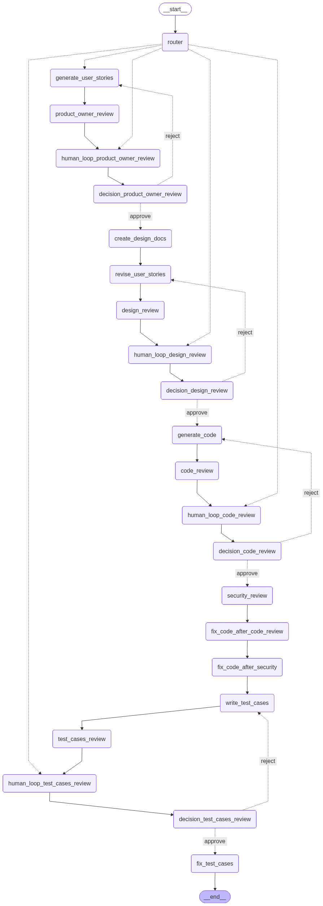

# AI Augmented SDLC App

**Project Owner:** Sapan Arora

An agentic AI system that automates a full software development lifecycle — from user stories
to tested, security-reviewed code — using a 22-node LangGraph multi-agent pipeline with
human-in-the-loop approval gates. Built to demonstrate practical experience designing stateful
multi-agent systems, resumable workflows, LLM reliability patterns, and production deployment.

Used AI coding assistants for implementation support.

**Live Demo:** [aiaugmentedsdlcapp.redglacier-fbd11a89.canadacentral.azurecontainerapps.io](https://aiaugmentedsdlcapp.redglacier-fbd11a89.canadacentral.azurecontainerapps.io)
> Available daily from 8 AM to 5 PM Eastern Time (EST) to optimize resource usage and reduce
> hosting costs. Outside these hours, the service may be unavailable.

## Tech Stack

Python 3.10 · LangGraph / LangChain · Groq (LLM inference) · FastAPI · Streamlit · Docker ·
GitHub Actions CI/CD · Azure Container Registry & Container Apps

## Key Features

- **22-node multi-agent pipeline** modeling a full SDLC team — Business Analyst, Product Owner,
  System Designer, Technical Architect, 2 Software Developers, Software Lead, Security Engineer,
  QA Engineer, QA Reviewer, and QA Lead — each backed by its own LLM agent.
- **Human-in-the-loop approval gates** at 4 stages (user stories, design, code, test cases),
  with conditional approve/reject routing that loops back to the relevant agent on rejection.
- **Resumable workflow state** — each run is checkpointed by thread ID so a human reviewer can
  approve/reject asynchronously and the graph resumes exactly where it left off.
- **LLM reliability layer** — automatic fallback across the agent model roster on rate limits,
  timeouts, empty responses, or malformed tool-call errors, so a single model hiccup doesn't fail
  the run.
- **Secured REST API** — API-key authentication (`x-api-key`) and per-route rate limiting
  (10 req/min) on every endpoint via FastAPI + slowapi.
- **Structured observability** — custom exception wrapper captures the original exception type,
  message, and traceback for real diagnostics instead of generic error strings.
- **Containerized & deployed** — Docker + Supervisor running FastAPI and Streamlit together,
  built and shipped to Azure Container Apps via a GitHub Actions CI/CD pipeline.

## Architecture



## API Endpoints

All endpoints require an `x-api-key` header and are rate-limited to 10 requests/minute.

| Method | Endpoint | Purpose |
|---|---|---|
| POST | `/initiatecodereview` | Starts a new SDLC workflow run from a human requirement message |
| POST | `/resumecodereview` | Resumes a paused run after a human-in-the-loop decision |
| GET | `/getworkflowimage` | Returns the LangGraph workflow diagram as a PNG |

## Steps to Run Locally

1. Clone the repo and create a Python 3.10 virtual environment.
2. Activate the environment and install the app: `pip install -e .`
3. Create a `.env` file in the project root with:
   ```
   GROQ_API_KEY="<your-groq-api-key>"
   API_KEY="<any-string-used-as-your-api-key>"
   ```
4. Run the app: `python -m app.main`
5. Frontend opens at `http://localhost:8501`; backend runs at `http://localhost:9999`.

Alternatively, run each service in its own terminal (useful when iterating on backend code,
since it can be restarted independently of the frontend):
```
uvicorn app.backend.code_review_api:app --host localhost --port 9999
streamlit run app/frontend/index.py
```

## Known Limitations / Areas for Improvement

- **No distributed tracing/observability (OpenTelemetry, Application Insights)** — logging today
  is local/basic. Skipped intentionally to avoid the added hosting cost on a personal-budget
  deployment; would add this first for any production workload.
- **Single container for frontend + backend** — FastAPI and Streamlit run together in one Azure
  Container App via Supervisor. Splitting them into separate container apps would allow
  independent scaling and failure isolation, at the cost of running (and paying for) two apps
  instead of one.
- **No automated test suite** — the project currently has no unit or integration tests covering
  node logic, the fallback/retry behavior, or the API contract. Next step for productionizing.
- **No conversation persistence across visits** — a `thread_id` is generated and sent with every
  request, but the LangGraph pipeline is compiled without a checkpointer, so it's never used to
  store or look up state; conversation state only lives in the browser's Streamlit session. If a
  user refreshes or returns later, the backend has no way to recognize them or resume their prior
  run. Adding a durable, short-lived store (e.g. Redis, keyed by a persisted session ID) would
  let LangGraph's own checkpointer resume a returning user's conversation.
- **No content moderation on user input** — the initial human message is passed directly into
  every downstream agent prompt with no profanity/toxicity/prompt-injection filtering. Acceptable
  for a portfolio demo, but a real deployment would need an input safety layer.

## Third-Party Components

This repository depends on third-party Python packages listed in `requirements.txt` and on external services used by the application. These components remain subject to their own licenses and terms.

## License

© 2026 Sarora09. Built for personal learning and as a portfolio project.

This repository includes third-party software and services subject to their own licenses and terms. See `THIRD_PARTY_NOTICES.md` and the respective project/model pages for additional details.
